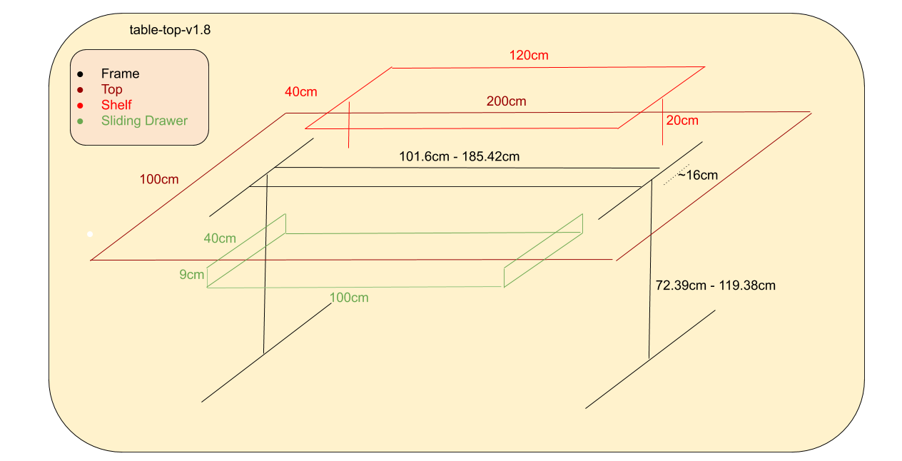

table-top
=========

This project aims shares the dimensions of an ergonomic table-top which
you can be use either with a desk base or a standing desk. The dimensions
were however originally designed in particular to be used with the
[Autonomous AI Standing Desk Frame - Home Edition](https://www.autonomous.ai/standing-desks/diy-smart-desk-kit?option16=38&option17=1881).

You can the design for this on [google docs](https://docs.google.com/drawings/d/e/2PACX-1vTyQoqklRpLNykUdB74-smzUnHAUiYhm5iGMZKm2VmdfpRV74etQpMrYIIo7jH5dqZKH_rnDXEInHiO/pub?w=1265&h=646).



# Autonomous AI Standing Desk Frame - Home Edition ==

Below is ASCII art of the dimensions for the
Autonomous AI Standing Desk Frame - Home Edition.

```
              /             width: 40" - 73"              /
             /-------------------------------------------/
            /|                                          /|
             |                                           | height: 28.5"-47"
             |  /                                        |  /
             | /                                         | /
             |/                                          |/
base:o 27.5" /                                           /
            /                                           /
           /                                           /
```

# Peripheral devices

This desk assumes you'd want to use a few peripheral devices. Two additional
monitors other than your main one, and assumes a large ergononic keyboard.

  * Two additional 15.6" (39.6cm) monitors: max width: 40cm
  * Microsoft Natural Ergonomic Keyboard 4000 v1.0, max height: 83.0mm (8.3cm)

# Table top components

 * Top
 * Shelf
 * Sliding Drawer

## Top

The design goals of the top are set to allow a shelf to put two monitors on
top, one on the left, one on the right. We want the monitors behind the center
of the desk, and so we need enough lenghth for us to put the two additional
monitors behind the center of the desk Because of this a lengh of 100cm is
used.

The width is set for at least enough space for having one monitor comfortably
on the left, and another one on the right. Assuming a ~40cm width per monitor
we want then at least 50cm per monitor. We then dedicate a full 100cm per
monitor setup.

# Shelf

The shelf will be put at the end of the table. The shelf should hold at least
two monitors at the end, each one approximately about ~40cm. Using 120cm for
the width will allow us to dedicate 60cm to each monitor side.

20cm of height is used given that 20cm + 28.5 gives us direct line of sight
without having to adjust our heads up or down towards the center of a screen..
This assumes one is sitting down with the adjustable desk set to the lowest
height.

We use 40cm of width for the shelf to allow the shelf to be 10cm behind the
center of the desk.


```
                     |
 \   O -  -  -  - - _|_
  |  |\           _______
  |  | --->  --/     |  
  |  o   ----------------
   --- \        |
   /|\ |        |
-------------------------------

```


Legend:

```

 \ 
  |       This is a chair
  |
  |
   ---
   /|\


 
 \   O        Person on a chair
  |  |\
  |  | --->
  |  o 
   --- \ 
   /|\ |


--/   This represents a laptop


 |
_|_   This represents a monitor

```

Sliding drawer
--------------

The sliding drawer is to allow you to put the keyboard and mouse at an
ergonomic height. We assume a huge ergonomic keyboard, which has a max
height of 9cm. We don't push it to 10cm to avoid the drawer from hitting
our legs.

You may need to adjust the height of the desk if the drawer is too low.
That is not an issue with a standing desk!

We want enough space for a wide keyboard and also a mouse, so we use 100cm
for the length.

The Autonomous AI Standing Desk Home Office has a piece of metal at the center
of width approximately max 16cm, so 8cm from the center. If we start the
drawer 10cm from the center that leaves us with 40cm for the drawer. That is
more then enough for us to fit a keyboard.

# License

Refer to the LICENSE file.
